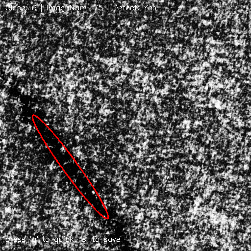

# DAGM2007 Defect Visualizer 🔍

> DAGM2007 데이터셋 기반으로 클래스/결합 유무/결합 위치를 시각화하는 Python 도구



---

## 프로젝트 구조

```
DAGM2007/
├── dagm_visualizer/
│   ├── dataset_manager.py      # 데이터 로딩 및 결합 위치 매핑
│   ├── visualizer.py           # 이미지 시각화 (ellipse 표시)
│   ├── controller.py           # 사용자 입력 처리
│   ├── main.py                 # CLI 진입점
│   └── README.md               # 설명 파일 (현재 문서)
├── DAGM_dataset/               # 이미지 및 라벨 데이터 폴더
│   ├── Class1/
│   ├── Class1_def/
│   ├── Class2/
│   ├── Class2_def/
│   ├── Class3/
│   ├── Class3_def/
│   ├── Class4/
│   ├── Class5/
│   ├── Class5_def/
│   ├── def_1.csv  # Class1 결합 위치 정보
│   ├── def_2.csv
│   ├── def_3.csv
│   ├── def_4.csv
│   ├── def_5.csv
├── add_zeros_2_filename.py     # 이미지 이름을 3자리로 일괄 변경
└── cut_data.py                 # labels.txt → def_?.csv 변환 스크립트
```
**파일 트리 준수**
---

## 해당 파일 기능

### `add_zeros_2_filename.py`

* `DAGM_dataset/Class*_def/*.png`의 이름을 `001.png ~ 150.png` 형식으로 일괄화

### `cut_data.py`

* `Class*_def/labels.txt` 파일을 파싱해 `def_?.csv` 형식으로 변환
* 사용 포맷: `filename,class,label,x,y,angle,w,h`

---

## 필수 라이브러리 설치

```bash
pip install opencv-python pandas
```

---

## 실행 예시

```bash
# bash
# 랜덤 이미지 (정상/결합 선택)
python main.py --random

# 결합 이미지만 랜덤
python main.py --random --defect

# 특정 건 표시
python main.py --class 1 --idx 23 --defect
```
```python
# python
# main.py
class_idx = None        # DAGM2007 class
idx = None              # idx.png
defect = True           # 결함 이미지 선택(True: 불량 이미지만 출력, False: 정상/불량 랜덤 출력)
random_select = None    # *.png 랜덤 선택

# 랜덤 이미지 (정상/결합 선택)
class_idx = None        
idx = None              
defect = False    
random_select = True

# 결합 이미지만 랜덤
class_idx = None        
idx = None              
defect = True
random_select = True

# 특정 건 표시 ex) Class1_def/23.png
class_idx = 1  
idx = 23
defect = True
random_select = False
```
## 조작
'q': 종료

's': 이미지 저장

else: 다음 이미지(랜덤) 선택

---

## 사용 기능

* 데이터셋 개발 또는 연구용 시각화 도구
* OOP 구조 + CLI 진입 지원
* 시각화 시 결합은 ellipse 방식으로 표시

---

## 참고 링크

* [DAGM 2007 Dataset](https://conferences.mpi-inf.mpg.de/dagm/2007/prizes.html)
* OpenCV ellipse: [https://docs.opencv.org/4.x/dc/da5/tutorial\_py\_drawing\_functions.html](https://docs.opencv.org/4.x/dc/da5/tutorial_py_drawing_functions.html)

---
